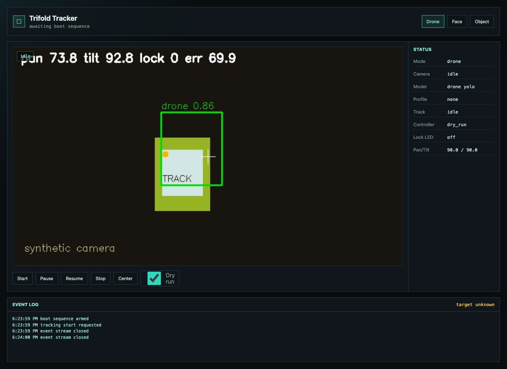
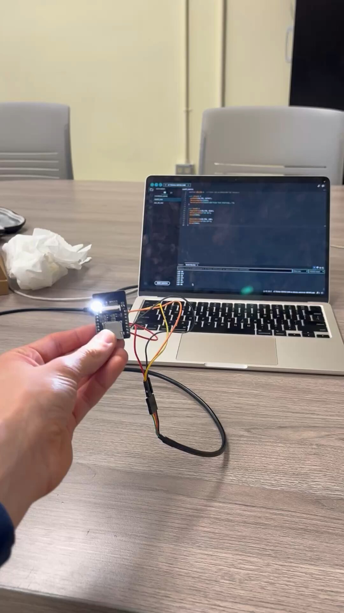
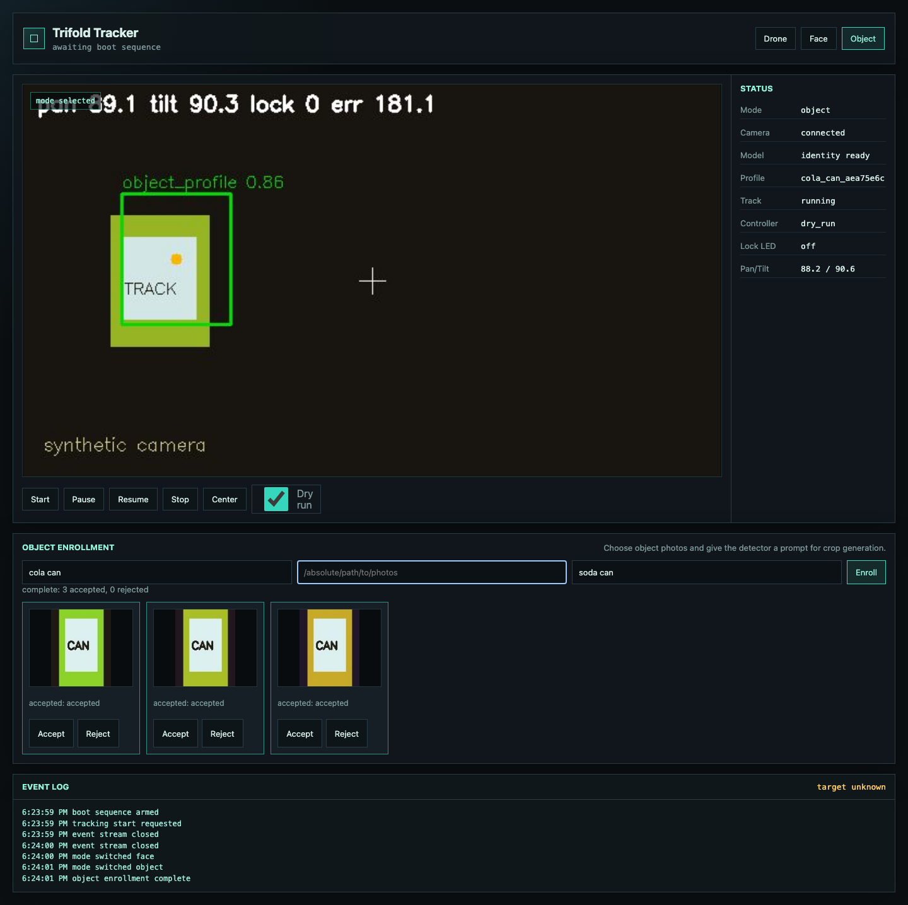
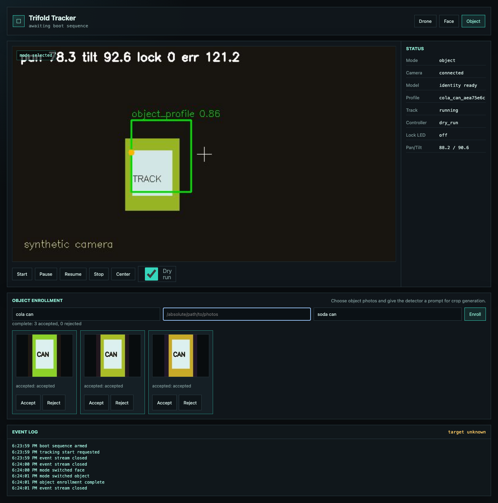
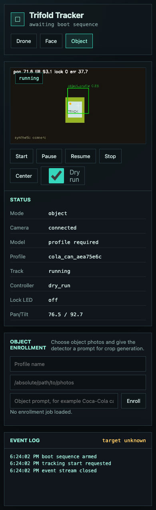
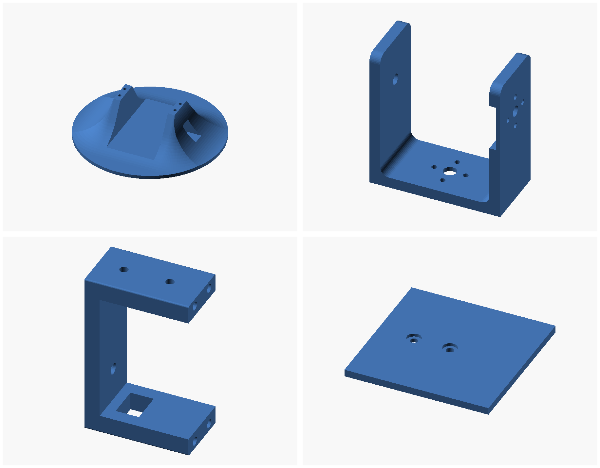
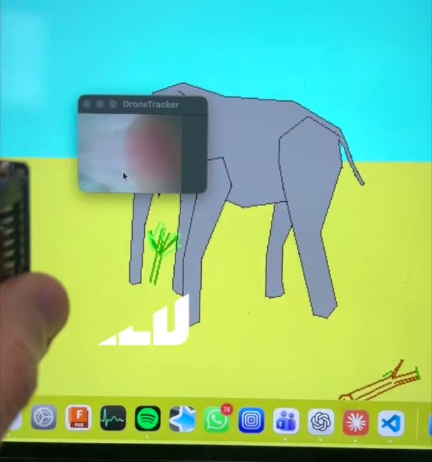

# Drone Tracker

Dual ESP32 visual tracking prototype with a local Mac control surface.

The system streams video from an AI Thinker ESP32-CAM, runs configurable
computer vision on a Mac or inference host, and sends bounded pan and tilt
commands to a second ESP32. An LED reports stable visual lock. Hardware control
is limited to the two servos and LED.



The deterministic GUI smoke fixture above exercises the detector overlay,
predicted alignment point, dry-run controls, live state, and event stream. It is
software evidence, not a physical-accuracy benchmark.

## What It Demonstrates

- MJPEG and framed TCP camera streaming from an ESP32-CAM
- Drone, enrolled object, and enrolled face detection modes
- Kalman prediction, deadband control, smoothing, and stale-frame handling
- Firmware-enforced servo limits, slew limits, and heartbeat timeout
- Browser GUI with live state, enrollment review, dry-run control, and events
- Optional remote inference while controller output stays on the Mac
- Reproducible CAD for the printed tracking mount

## Architecture

```text
ESP32-CAM -> video -> Mac host -> detections -> prediction and control
                                      |
                                      +-> browser GUI and status events
                                      |
                                      +-> pan, tilt, and LED -> tracker ESP32

Optional inference host <- JPEG frames and profile selection -> detections
```

The Mac owns prediction, calibration, servo limits, lock timing, dry-run state,
and all commands sent to the tracker controller. The optional inference service
returns detections only.

## Development Evolution

The first prototype used one ESP32-CAM as a WiFi access point with a framed,
bidirectional TCP connection. A one-frame host queue discarded stale camera
frames, periodic YOLOE detections re-seeded LK optical flow, and the host sent
bounded servo angles back over the same connection. The project briefly tested
HTTP streaming and UDP packetization before returning to framed TCP, separated
servo power to prevent brownouts, and ultimately moved pan and tilt control to a
second ESP32.

The current implementation replaces the early single-board tracking loop with
configurable detection backends, Kalman prediction, a browser control surface,
firmware-enforced motion limits, and an optional detection-only inference host.



This first-boot image is preserved from slide 6 of the original project
presentation. It documents the hardware bring-up stage without exposing the
presentation's unrelated framing or personal desktop content.

## Repository Map

| Path | Purpose |
| --- | --- |
| `firmware/camera_stream_ai_thinker` | Camera capture, MJPEG, and TCP JPEG streaming |
| `firmware/tracker_controller` | Pan, tilt, LED, limits, and heartbeat handling |
| `mac_tracker/drone_tracker` | Detection, prediction, control, enrollment, GUI, and inference API |
| `config` | Safe versioned configuration examples |
| `smoke_tests` | Incremental software and hardware checks |
| `tests` | Hardware-independent Python test suite |
| `cad` | Printable mount and source STEP model |
| `BUILD.md` | Setup, wiring, operation, and verification |

## Interface Evidence

### Object Enrollment

The object workflow builds a local identity profile from accepted crops while
keeping the controller in dry-run mode.



### Identity Tracking

After enrollment, the selected profile drives the live detector while the GUI
continues to expose tracking, controller, lock, and pan/tilt state.



### Mobile Layout

The same controls and state remain available in the narrow responsive layout.



## Mechanical Design

The repository retains the original STEP assembly and four printable 3MF
components. This preview was rendered directly from those checked-in exports.



## Quick Start

```sh
python3 -m venv .venv
.venv/bin/python -m pip install -e ".[dev]"
cp config/default.yaml config/local.yaml
.venv/bin/drone-tracker-gui config/local.yaml --mock
```

Open `http://127.0.0.1:8765`. Mock mode exercises the full local UI without
camera, controller, or model files. See [BUILD.md](BUILD.md) for hardware setup.

## Verification

```sh
python3 -m pytest -q
tools/compile_arduino.sh
python3 smoke_tests/gui_smoke/gui_smoke.py
```

The Python tests run without attached hardware. Firmware checks require Arduino
CLI plus the ESP32 platform and the libraries listed in [BUILD.md](BUILD.md).
The GUI smoke test accepts `--browser-executable` when Playwright's bundled
Chromium is unavailable.

## Demo Evidence

### Earlier hardware revision

[](media/demo/prototype-tracking.mp4)

The linked clip is an authentic tracking demo on an earlier hardware revision.
The later iteration replaced that mount with the 3D-printed harness shown in
the CAD preview above; this video does not claim to demonstrate the final
mechanical configuration.

The GUI captures are reproducible synthetic smoke-test artifacts. Together,
the prototype video, first-boot photo, CAD, and current GUI evidence document
working physical bring-up and the subsequent software and mechanical evolution.

## Current Limits

- Model weights and enrollment profiles are local artifacts and are not stored
  in Git.
- Live accuracy depends on the selected detector, model, camera placement, and
  calibration. This repository does not claim a measured accuracy benchmark.
- Hardware smoke tests require the two boards and external servo power.

## License

MIT. See [LICENSE](LICENSE).
