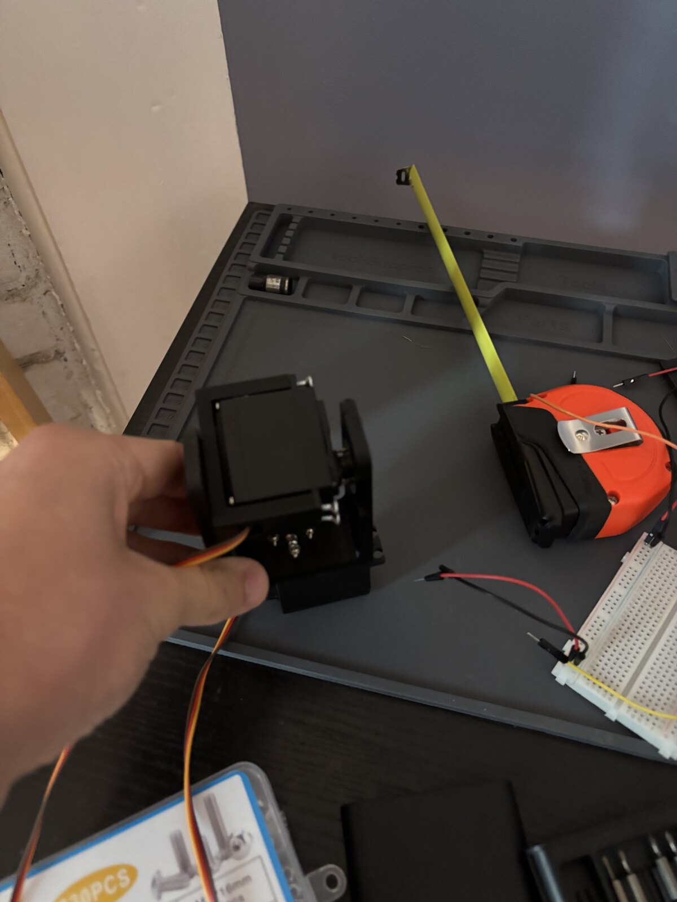

# Drone Tracker

An ESP32-CAM pan/tilt prototype that streams JPEG frames over its own Wi-Fi
network, runs open-vocabulary detection on a Mac, and moves the camera to keep a
text-prompted target near the image center.

**[Watch the hardware prototype track a target](https://youtu.be/l-cdVXwM77g).**
The video shows this single-board architecture on the original mount.

## Main limitation

I deliberately ran inference on my Mac instead of renting a GPU server to test
the practical limits of local inference (and save money). Grounding DINO could not run at the
camera frame rate, so it periodically created or corrected the target box while
pyramidal Lucas-Kanade optical flow propagated that box between model passes.
This kept the loop responsive, but KLT can accumulate drift until the next
detection. Faster GPU inference would permit more frequent corrections; this
repository does not claim a measured latency or accuracy benchmark as they would be too noisy anyway.

## System at a glance

The AI Thinker ESP32-CAM creates the `DroneTracker` access point, captures QVGA
JPEG frames, and sends length-prefixed images to a Mac over one TCP connection.
A receiver thread keeps only the newest complete frame, preventing detector
latency from building a stale-image backlog.

Grounding DINO Tiny periodically localizes the prompted target. Between those
refreshes, Shi-Tomasi features inside the target box are propagated with
pyramidal KLT optical flow, and the median surviving displacement translates
the box. The Mac converts box-center error into bounded pan/tilt angles and
returns a four-byte command over the same socket; the same ESP32-CAM drives both
servos on GPIO 14 and GPIO 15.

The detector is pinned to
[`IDEA-Research/grounding-dino-tiny`](https://huggingface.co/IDEA-Research/grounding-dino-tiny),
uses a 480-pixel short edge with a 640-pixel maximum edge, and selects Apple
Metal (`mps`) automatically when available. PyTorch falls back to CPU for an
unsupported MPS operation. The model is downloaded before joining the isolated
ESP32 access point and then loaded from the local cache.

Grounding DINO refreshes every 10 processed frames or immediately after KLT
loses the target. Each refresh seeds at most 20 Shi-Tomasi corners inside the
new box. KLT uses a 7 x 7 window and two pyramid levels; fewer than three
surviving points invalidates the track and forces another detection.

## Alignment and transport

The Mac converts the tracked box center into normalized image error:

```text
ex = (bbox_center_x - frame_center_x) / (frame_width / 2)
ey = (bbox_center_y - frame_center_y) / (frame_height / 2)

pan  = clamp(90 + 90*EMA(ex) + pan_offset,  0, 180)
tilt = clamp(90 + 90*EMA(ey) + tilt_offset, 0, 180)
```

The error EMA uses `alpha=0.40`; commands stop inside a 10-pixel dead zone.
Frame parsing is self-synchronizing after partial or corrupt reads, rejects
payloads over 200 kB, and preserves a split start marker across TCP chunks.

## Run it

```sh
python3 -m venv .venv
.venv/bin/python -m pip install -e ".[dev]"
.venv/bin/drone-tracker-download-model

# After flashing the firmware, join Wi-Fi "DroneTracker" with password "dronetrack"
.venv/bin/drone-tracker --offline --device mps --prompt "a small drone"
```

Use `--no-servos` for vision-only testing. See [BUILD.md](BUILD.md) for wiring,
firmware compilation, model caching, and the ordered bring-up procedure.

## Explore the implementation

| Area | Start here |
| --- | --- |
| Runtime loop | [`drone_tracker/app.py`](drone_tracker/app.py) |
| Grounding DINO and MPS | [`drone_tracker/detector.py`](drone_tracker/detector.py) |
| Shi-Tomasi and KLT | [`drone_tracker/tracking.py`](drone_tracker/tracking.py) |
| TCP framing | [`drone_tracker/transport.py`](drone_tracker/transport.py) |
| Alignment control | [`drone_tracker/control.py`](drone_tracker/control.py) |
| ESP32-CAM firmware | [`firmware/esp32_cam_tracker`](firmware/esp32_cam_tracker) |
| Protocol and timing | [ARCHITECTURE.md](ARCHITECTURE.md) |
| Mechanical files | [`cad`](cad) - STEP assembly and four printable 3MF parts |

## Revisions



*Improved 3D printed mount that was made after the demo.*

This project could be vastly improved with GPU inference and a fine-tuned model for drones, but I lacked the resources at the time of production.

## License

MIT. See [LICENSE](LICENSE).
